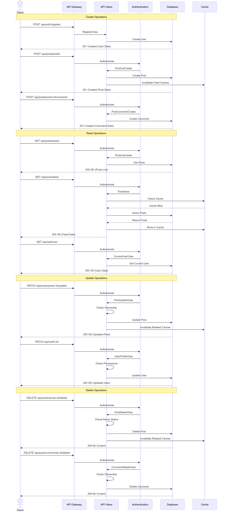
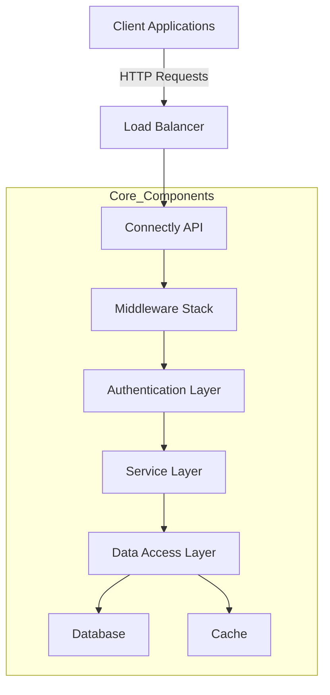
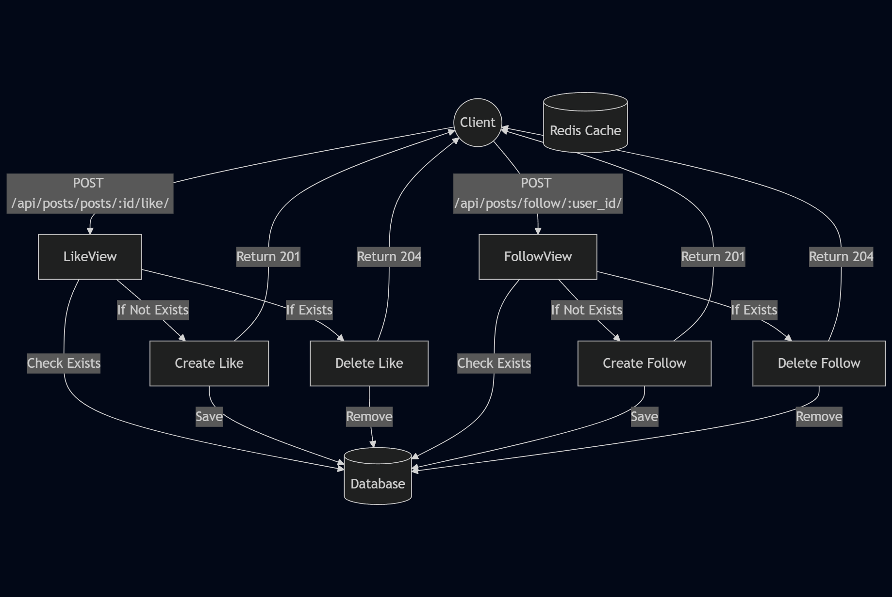
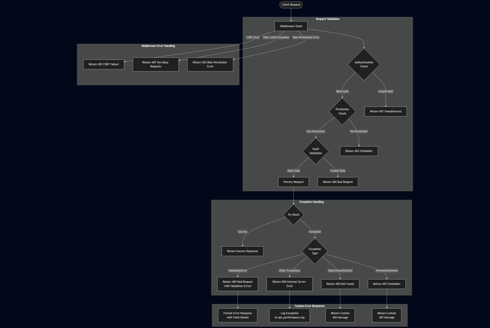

# Connectly API Technical Documentation

## System Architecture Overview

The Connectly API is a Django-based RESTful application designed to provide social media platform functionality. This documentation covers the architecture, data models, flow patterns, and security mechanisms implemented in the system.

---

## Table of Contents

1. System Architecture
2. Data Models
3. Authentication and Authorization
4. CRUD Operations Flow
5. Data Flow Patterns
6. Error Handling
7. Access Control System
8. Performance Considerations

---

## System Architecture

The Connectly API follows a layered architecture pattern with distinct responsibility separation:

### Core Layers

1. **Middleware Layer**: Handles cross-cutting concerns like CSRF protection, role-based access control, and performance tracking.
2. **Authentication Layer**: Provides multiple authentication methods (JWT, Session, OAuth).
3. **Service Layer**: Implements business logic for users, posts, comments, likes, and follows.
4. **Data Access Layer**: Manages database interactions through Django models and serializers.
5. **Caching Layer**: Optimizes performance for frequently accessed data.

---

## Data Models

The system uses five primary entities with well-defined relationships:

[](https://mermaid.live/edit#pako:eNqdVMFu2zAM_RVB5zSwk9RufM3QyzagwLDLECBQLTpRa4sGJTfN0vz7JDlOu9lNuvokPz6Sj6SoPc9RAs840Bcl1iSqpWbuWzTGYvXTALGXl6sr3LM7NJZlbMlzAmHBLPl7zAVWFeiWvCV1lvtNPUIg1kAFUnWGeotlidtAVlpZ5UUwYVgRcKAPeRLkoJ7-cpSdY6hwoIYctRVKmyHeSX8X-KTiGGAgXi3IH7Hw3J7mfYv4TzmWkuzu6ytkLCm9Zo1jalFBzwCVUGUPrYUxWyTZMxSKjF0NRirFexbC8g14j1gyZVYit67-Pm6sKIoBuHET92W8mqSbqFUVhMPqAZUGOWANwkpcq2PvDl0Tw1zOt89DorEbpJWz3L6xWHi2zE_ajabfP1JPIt8NiGmXQa6E_UdMN_DP6vGW2hU0iIcL1FrcfdJNWYp7NxN-qZzLssN9vqzZD-6jii8nPe7n5bTdqg-l7rb5f9LzEa-A3MpI9wKG9EtuN-DuPPeLKgU9-qYeHM9NCX_sdM4zSw2MOGGz3vCsEKVxf03t0xxf0BNaC_0Lsepc1uTzHN1BS6AFNtryLI6mgcyzPX_m2WQWjWdRNInSm0maTNOb2YjvHHw9TpIkTafxfDKJ5854GPHfIX40ns8cMU6j6XWSxOmIg1QW6Xv7tocn_vAHQsfU7Q)

### Database Schema Optimizations

The database schema includes several optimizations:

1. **Indexing Strategy**: Indexes on foreign keys and frequently queried fields
2. **Composite Constraints**: Unique constraints on (user, post) for likes and (follower, followed) for follows
3. **Self-referential Relationships**: Comments support threaded discussions through parent-child relationships

---

## Authentication and Authorization

The authentication and authorization system supports multiple methods and implements a robust role-based access control system:

[![](https://mermaid.ink/img/pako:eNqNlltP2zAUgP9KZGkSSAXSG708DKGyISYBFZdNW8uDSUxrNbU7O6GDpv99x5ckTpoi-tDEx9-5OeecZIMCHhI0RC8RXwdzLGLv4WLKPPiNIkpYfHBgroeHSmp2ZPI8E3g196boPInnsEsDHFPOvGsSz3kop8iA6ndPpIQtBU7svVfWeirgH78eNAjX_dAl57OIaM7cerdqYQnCws9EOhY8gGjcSEeChIrAkdz8xBENcUxc4XYnKdgEZmIumdCJ9IEvSAZdEkaEwlRuekPu5JR5neTubYKad3CVzH0SqAwmlcSsuAJ_xzRKBKnCSkzCT5wcF_R978EpYDQnwWKj_ytPzjm2Ox4RF3yURGihw9yu4Zxc6I5InoiAmB05pyuHHgv6ioM3l7cieBxxTNnMfWzn-mguBWYxCSdm5dnlUxW7IIwWlFl5R17Hb550_HbdmX354lXPF7pKuu3kHR19TVXaDC_JyRhLueYiTN0u-Qxu-2QHdcsldRqliNFxpDTc-jaANV2_WVjU--WqLZyU5ToyvcgCc8p3r8IVe62q2CIu_DjxFU7Scnd-SDoNWs_ZKPb4LznSJ7KTmeOhDjCQI9Reszk54nxBSWqfcD1bjJNdzgasuW9CcKGaacWZLNksFW_R6PW1ez6-AiN_EyJjb02hDpRSWoyAclKmI7Ve0RgEjjOfBHXsI8Nl2m3IwkFuwzgIl5Tp0Cg8wzNQUgIzGK6kWZ1t6zSv4Q0Ik1mfTq4Nwlw3B-r178gsibDQ0yx15pdzFHkoWuE3kWl5FtViN3xf5llwH1orQfttFfGagpdGUmuywt7wOIPdOVzYdqVaY5w8RzTIR3qtk10lJYD2qWpVMynZspr6XZUVbKVBHCOatpO9pkdQAy2JWGIawpfSRntEUKBLMkVDuA2xWKj34RY4qFx-_8YCNIxFQhpI8GQ2R8MXGCiwSlZqvl1QDO_WZS5dYfaH82WmMhPKj1WHFwwcOU9YjIbNZkfDaLhB_2DZ6h_3Bq3moHva9P223-s10Bsa9lvHzU6v2e12-z2_fToYbBvoXZv3j3v9VqvX7fT77Y7f7fitBiIhhcK-Nh-B-ltw-x_c21wC?type=png)](https://mermaid.live/edit#pako:eNqNlltP2zAUgP9KZGkSSAXSG708DKGyISYBFZdNW8uDSUxrNbU7O6GDpv99x5ckTpoi-tDEx9-5OeecZIMCHhI0RC8RXwdzLGLv4WLKPPiNIkpYfHBgroeHSmp2ZPI8E3g196boPInnsEsDHFPOvGsSz3kop8iA6ndPpIQtBU7svVfWeirgH78eNAjX_dAl57OIaM7cerdqYQnCws9EOhY8gGjcSEeChIrAkdz8xBENcUxc4XYnKdgEZmIumdCJ9IEvSAZdEkaEwlRuekPu5JR5neTubYKad3CVzH0SqAwmlcSsuAJ_xzRKBKnCSkzCT5wcF_R978EpYDQnwWKj_ytPzjm2Ox4RF3yURGihw9yu4Zxc6I5InoiAmB05pyuHHgv6ioM3l7cieBxxTNnMfWzn-mguBWYxCSdm5dnlUxW7IIwWlFl5R17Hb550_HbdmX354lXPF7pKuu3kHR19TVXaDC_JyRhLueYiTN0u-Qxu-2QHdcsldRqliNFxpDTc-jaANV2_WVjU--WqLZyU5ToyvcgCc8p3r8IVe62q2CIu_DjxFU7Scnd-SDoNWs_ZKPb4LznSJ7KTmeOhDjCQI9Reszk54nxBSWqfcD1bjJNdzgasuW9CcKGaacWZLNksFW_R6PW1ez6-AiN_EyJjb02hDpRSWoyAclKmI7Ve0RgEjjOfBHXsI8Nl2m3IwkFuwzgIl5Tp0Cg8wzNQUgIzGK6kWZ1t6zSv4Q0Ik1mfTq4Nwlw3B-r178gsibDQ0yx15pdzFHkoWuE3kWl5FtViN3xf5llwH1orQfttFfGagpdGUmuywt7wOIPdOVzYdqVaY5w8RzTIR3qtk10lJYD2qWpVMynZspr6XZUVbKVBHCOatpO9pkdQAy2JWGIawpfSRntEUKBLMkVDuA2xWKj34RY4qFx-_8YCNIxFQhpI8GQ2R8MXGCiwSlZqvl1QDO_WZS5dYfaH82WmMhPKj1WHFwwcOU9YjIbNZkfDaLhB_2DZ6h_3Bq3moHva9P223-s10Bsa9lvHzU6v2e12-z2_fToYbBvoXZv3j3v9VqvX7fT77Y7f7fitBiIhhcK-Nh-B-ltw-x_c21wC)

### Authentication Methods

1. **Session Authentication**: Traditional cookie-based authentication for browser clients
2. **JWT Authentication**: Stateless token-based authentication for mobile/SPA clients
3. **Google OAuth**: Social authentication with Google as identity provider

### Authorization Process

1. **Role-Based Controls**: Four user roles (admin, moderator, user, guest) with hierarchical permissions
2. **Resource Ownership**: Only owners can modify their content (posts, comments)
3. **Privacy Settings**: Content can be public (visible to all) or private (visible only to creator)

---

## CRUD Operations Flow

The API follows standard RESTful CRUD operations for all resources. Below are the flows for the main entities:

### User CRUD Flow

[](https://mermaid.live/edit#pako:eNp9lW1v2jAQx7-KZakSlWhJeArkxSaUsK3S2qIWJm1QTR5xwSqJK8dZ1wLffWc7Dw7Q9k3v7v-_s_HPVrZ4ySOKffy44S_LNRESTcNFguAv2DCayEbD_D8_V1WjnJ2h4G48mo5tI7q4-LSb3N5PUYs8sxbJ5Lol6IqlkorWDt3l4WhyNS_iH4y-PJgZlqwH_SUbFhFJd2iWgtFkjCdbHX7em666pht_0nSHAkGhV6lzE6IgSyWPVSVfsLKoNhQSSf6QlJryvFHk56ftd1RmItELmFBvRU8pf1Dh0A3mjN7d9Q3f5R1jIXg51HLpem22rhwML_kAnvCIztexDSemgCXIhABZbUmRsVILTt2kR41gApTYUu9uh1QerOnyaWsptARVyhWjL1Qu1_oEdVQsgixGpaWGSFePCdXN91QwOLw3cwnKzJ5esxxBqu9Y8VGVruMWbCBEs0SdJBcwJHqo-pT0DpfZJDz5bkbT4JvFxs9gT79ZBIRmz-odKDhqnxPBH9mGWnBK_SSXXP2YzoGpYjShImZpCpNM9-1LAkcFt24UxSwp2g9cVXt-famZb56uxlh01g1Vo8k1ulyyuFVi7VqY8vG9OLDn71IXo_LxmtRepeZ7j2Y4_j4-QdOUT-GM6IZK9e5CHRRUTWZBLeWTUHP1Y6gHpupwNTvTeJXWSVZSZTdzNAsT2qdUiTUWpnzM4sBuzrjtdAsOEKIbjgKeSPg9NRJKsingJo7h3hEWwcdrq6lgOIWYLrAPYUTE0wIvkj34AAG_f02W2Jcio00seLZaY_-RbFLIMo04ZGQlSFxWn0nyi_O4aFkJtU7eTpOIioBnicS-6_a1Gftb_A_S9uDSG7bdYa_vOk7H8bwmfsX-oH3pdj231-sNPKfTHw73TfymxzuX3qDd9nrdoTd0O52-A-NoxCQX1-a7rD_P-_8aCI45)

### Post CRUD Flow

[](https://mermaid.live/edit#pako:eNp9Vd1u2jAYfZXIUqVWoiWBQiAXm1DCtkrdigqttIVp8hIXrIYYOY5YC7z7HDuJbRLKBfl-zjl2fPwpexCRGAEPvCRkF60hZdYiWKYW__kJRim7vJTPq6uiKjsXF5b_OJ0spjrQur7-dJg9zBdWF25xd0sylpX_B8unCDI049lkdhcWz3ucMVn9XaroECE2ydmaC-MIMkzSgyV6vOavUfS617oo_nyUIgZEiPxE2cF6hgmOS_W9SKwAMlix9LYiqQ2FMhTqjd0WBKH2F2ZI41xWtat2ip8gSH0YrVEoQuspQ9QShaxi1BDBeEQsp6kQl6HYkFi7JChEuURhjOEbty1ouPZ12mpaYVGhlZ31TEe0WqYAvNFumQFRp_8FsWgt6qEIxbtWB6OaxulrnMbpn1BmcIXT0o4srDJ-gFme1MsYIEGbI4r5ZXkveXVq7M4EnXPiaRa0TtBk4X9ruuEVjz847ubb4qZyd5628clIycozRrtyIwak1R8NcdYgE6McetiliMpZvMtkVlFUqzmDSu6DSVQgJaBqoQz1eTQJ9Y3QOI0bcUKRsyOLsT5kZUmtVlsYTO-nLRbK8gcexihBwsNABLqHsqJ5aEBaPdQQZz00MepMJ_EGp48kQbWPolLRzLaiKblQhroVqmlYoXEaVpxQ5MH37FvdBp5aP4jlk5Tx1-NE0AEbRDcQx_zztRfGAP7qG7QEHg9jSF-XYJkeOQ7mjMzf0gh4jOaoAyjJV2vgvcAk45kcqQDDFYWburqF6S9CNhVlRYt1SjpKY36_SZ4y4DnOSICBtwf_eNob3bjjnjMeDB3b7tuu2wFvwBv1bpxb1xkMBiPX7g_H42MHvAt5-8Yd9Xru4Hbsjp1-f2gPOwDFmBH6XX6ZxQf6-B9d0Jno)

### Comment, Like, and Follow Operations

Similar CRUD flows are implemented for Comments, Likes, and Follows, with appropriate permission checks and cache invalidation where needed.

---

## Data Flow Patterns

The system implements optimized data flows for various operations:

### Feed Generation Data Flow

[](https://mermaid.live/edit#pako:eNqNVFtv2jAU_iuWpUogUUhCISQPk1oYm7RVYrTaw2APXnxKLIId2c5YRvjvc-yQglqh5cXn8n3nGvuAE0EBx3gjSZ6i59maI_NNMwZcdzru7HaddUY0-UUUrDonqfuzwZMkNeYlUKac4jzOe3OD5gAUzTOxR3umUwthfHOeDN3efqg-fXxGA5KzQS6UVoMXwxpUlvydwX5lo9RSk_bksNyHgmXUJUdfoHylvYOdppBsHbZyx2u1LoJFWemRKVWhbwXIcvawsmc7iaaOxulaAI0WdfVVi3oLWkj2myQlmrNMg2yjvwXecy400YCmouBaXUEuyIZxg7wCedJCAlqCKrI6VNv3JWoJupDcbazu4HKQ78_oM9MVckRroKsmitNsnGZW56j_znexvLmQO6LrPnLBFVxd9D2lqJkMExx9ZXyrrhLOqqmaP3PNcQ_vwCRl1NyUgy0L6xR2sMaxESmR2zVe86PBkUKLp5InONaygB6WotikOH4hmTJakVOzohkj5rrtWmtO-A8hdifKRtZ5GjpwCtIuH8d-4Fkwjg_4T61O-mEU-NFo7Hve0AvDHi5xPAn6_l3oj0ajSegNx1F07OG_NrzXDydBEI7uojDyh8OxN-5hc2PNX_HoHgH7Fhz_ASTiUMU)

### Social Interaction Data Flow

---

## Error Handling

The API implements a comprehensive error handling strategy:

### Error Handling Strategy

1. **Validation Errors**: Return 400 Bad Request with specific field validation errors
2. **Authentication Errors**: Return 401 Unauthorized for invalid/missing credentials
3. **Permission Errors**: Return 403 Forbidden for insufficient permissions
4. **Not Found Errors**: Return 404 Not Found for missing resources
5. **Server Errors**: Return 500 Internal Server Error and log details

### Performance Monitoring

- The `PerformanceMiddleware` tracks request processing time
- Slow requests (>0.5s) are logged to api_performance.log
- Response headers include `X-Request-Duration` for client-side metrics

---

## Access Control System

The API implements a sophisticated access control decision flow:

[](https://mermaid.live/edit#pako:eNqNVF1v2jAU_SuWpUqbBCwhQCAPm1DZpj7QItZp2oAHExuwCjZznHaU8N937XxCgY0XfO695_h-xXscSspwgBdr-RKuiNLocTAVCH43N2hIuEBMaLVDW8mFTh1j9jtmkX436Y_ucjB7j-r1j6gf69XtioVP-7vIAiDzkGhGPx0MuVCu-LgUKDSc1FlIGMHkXibW0nLcyZjpWAkER_RdEDBKxV8ZnZ3j_WRRgj4LatN-3G3ZPgfIoJNsBnyxYArygWKzKA1RURpQlbHifbrhAvIyf2W1BqW6ZyhjtozXRCVoLNcs5ZgTssfLpEjGKmTo4UUw4Nq_4kKLLl54K4U2BY0UfybhLskPKX0ko8J1OhlTRzqQrP6yzrK11vZVEbiETvphyKIIZXB2lmUHaUwtxysn6aEvUs05pUzMjrKwxUUrvj3KpGxAmYm1Xc3khHUva2gea9hcQvP1TSwqWmtA_UGsd7k_b_MZKSIo-qG4ZqWWjfq_OrMZHFVZnZS9ZhTP1zxEZmgwRwuuFvxWwBggw0whRcfbZDeislIVpWpo2feq69_ZvNHIp2B34sNQ0vTTgDZl8cU3ZZxMES2LZb-kWCR1pfe4hjdMbQin8OjtbaUYnqINm-IAjpSopymeigPEwRMjv-1EiAOtYlbDSsbLFQ4WZB0BircUbhpwslRkU1i3RPyScpNTlsrck9HhbYF8ZSw0DlyvaYNxsMd_ADa7Db_XdHvtjus4nuP7NbzDQbfZcFu-2263u77jdXq9Qw2_Wnmn4XebTb_d6vk91_M6TqeGGeXQpGH6nttn_fAXUyL5iA)

### Access Control Components

1. **Permission Classes**:

   - `IsAuthenticated`: Ensures user is logged in
   - `IsAdminUser`: Restricts access to admin users
   - `IsOwnerOrReadOnly`: Allows read access to all, modify only for owners
   - `IsPostOwnerOrPublic`: Handles post privacy visibility
2. **Middleware**:

   - `RoleMiddleware`: Enforces role-based restrictions (e.g., only admins can delete)
   - `DisableCSRFMiddleware`: Handles CSRF protection during development
3. **Special Case Handling**:

   - Delete operations: Admin-only restriction via middleware
   - Private content: Owner/admin/moderator access only
   - Modified content: Owner-only modification with admin override

---

## Performance Considerations

The API includes several performance optimizations:

1. **Caching Strategy**:

   - Feed data is cached with versioned keys
   - Cache invalidation on content updates
   - Batch processing for large operations
2. **Database Optimizations**:

   - Strategic indexing on frequently queried fields
   - `select_related` and `prefetch_related` for efficient joins
   - Annotated fields for counts (likes, comments)
3. **Request Throttling**:

   - Authentication endpoints: 5 requests/minute
   - Regular users: 40 requests/minute
   - Anonymous users: 20 requests/minute
4. **Monitoring**:

   - Request duration logging for slow endpoints
   - Performance tracking via middleware
   - Detailed error logging for troubleshooting

---

This technical documentation provides a comprehensive overview of the Connectly API's architecture, design patterns, and implementation details. It serves as a guide for developers working with the system, highlighting the flow of operations, security mechanisms, and optimization techniques employed throughout the application.
